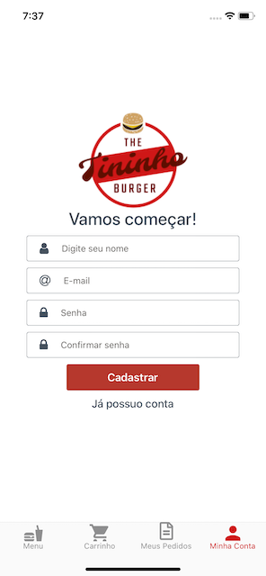

# Tininho Burger - Meu projeto pessoal
Aplicativo para realizar pedidos em um restaurante.

## O que é o projeto
Projeto desenvolvido em React Native para aprofundar e aprimorar meus conhecimentos.

## Funcionalidades do aplicativo

### Menu

### Personalização e seleção de produto

### Carrinho de compras

### Finalizar pedido

### Seleção do endereço de entrega

(em desenvolvimento)

### Histórico de pedidos (Meus pedidos)

(em desenvolvimento)

### Acompanhar status do pedido

(em desenvolvimento)

### Login

### Novo Cadastro

### Menu do usuário logado

### Editar dados do usuário

### Cadastar/Editar endereços de entrega (Meus endereços)

(em desenvolvimento)

### Pontos de fidelidade

(em desenvolvimento)

